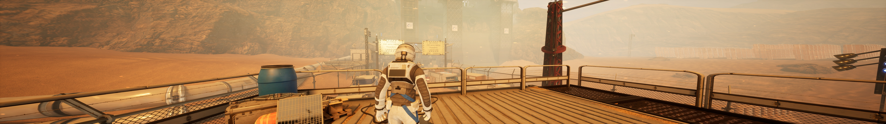

## Deliver Us The Moon Ultrawide and FOV fixes

Two tools made to address the field of view and black bars issues affecting 21:9 and wider displays.
* The small patcher is intended for ultrawide monitors.
* The trainer also allows to modify the field of view in real time and supports the Microsoft Store / Game Pass version of the game.

If using the trainer, make sure the game is already running.

Tested the tools on the latest GOG version at 2560x1080 and 7680x1080.

You can buy me a [coffee](https://ko-fi.com/rozziroxx) or become a [patron](https://www.patreon.com/rozzi).
